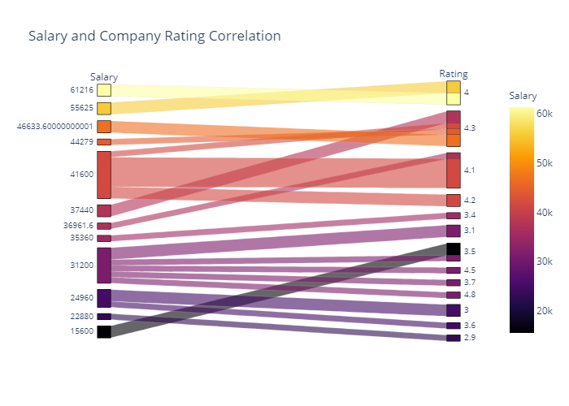
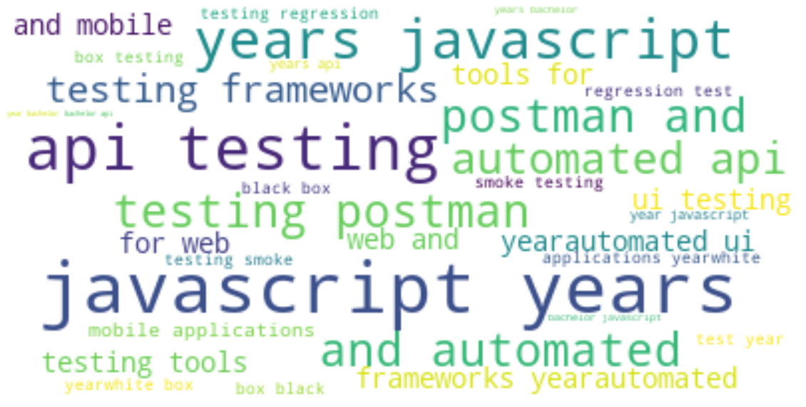
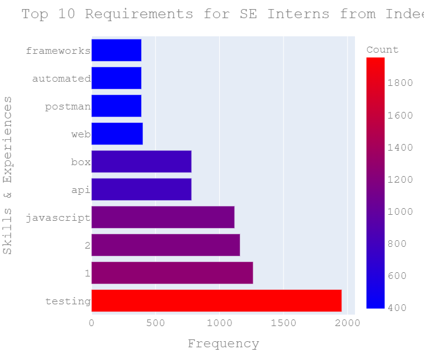

# WebScrapping with BeautifulSoup

#### **Main Idea**: Web Scrape the website Indeed.com with BeautifulSoup to see internship openings for open Software Engineering positions and spot trends for:
        - programming skills (languages, frameworks, types of experiences) that are most in demand 
        - locations of different job openings
        - compare how salary for SE interns (if available) is different across different states 
        - does company rating affect salary
        
### Final Plots from Data Visualization

### Plot 1: Top Keywords in the Describtion section 

### Map 1: Locations of job opeinings in the dataset 

### Map 2: Locations with higher salaries displayed by circle sizes

### Plot 2: Correlation between Salary and Rating 

### Plot 3: Top requirements for Software Engineering Interns displayed by frequent keywords 

### Plot 4: Top requirements for Software Engineering Interns (in a bar chart) 

